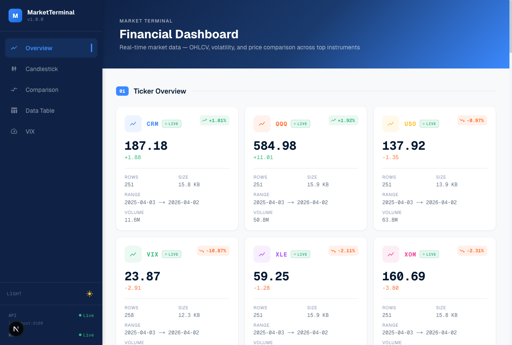

<div align="center">

# 📈 Market Terminal

**Real-time financial data pipeline with interactive dashboard**

[](https://github.com/jeremygu000/yahoo-finance-data/actions/workflows/ci.yml)
[](https://www.python.org/downloads/)
[](LICENSE)
[](https://github.com/psf/black)
[](https://mypy-lang.org/)

Multi-source market data fetcher → Parquet storage → REST & WebSocket API → Next.js dashboard with live charts, price alerts, and watchlists.

</div>



## Features

- **Multi-source data** — Yahoo Finance, Tiingo, FMP with automatic fallback chain
- **Multi-timeframe** — 1m, 5m, 15m, 1h, 1d, 1wk, 1mo intervals
- **Real-time WebSocket** — Live price updates pushed to the dashboard
- **Price alerts** — Configurable above/below/percent-change triggers with WebSocket notifications
- **Watchlist** — Persistent user-defined ticker lists
- **Interactive charts** — Candlestick (K-line), multi-ticker comparison, VIX dashboard
- **Historical backfill** — CLI command to fetch arbitrary date ranges
- **Smart caching** — In-memory LRU cache with TTL for fast repeated queries
- **Scheduled fetching** — macOS launchd integration for automatic daily updates
- **Type-safe** — mypy strict, 151+ tests, full Pydantic schemas

## Architecture

```
┌─────────────────┐     ┌───────────────────┐     ┌─────────────────┐
│   Data Sources  │     │   Storage Layer   │     │   Consumers     │
│                 │     │                   │     │                 │
│  Yahoo Finance  │────▶│  Parquet Files    │────▶│  Python API     │
│  Tiingo         │     │  (~/.market_data) │     │  FastAPI REST   │
│  FMP            │     │                   │     │  WebSocket /ws  │
└─────────────────┘     └───────────────────┘     │  Next.js UI     │
                                                  └─────────────────┘
```

## Quick Start

### Docker (recommended)

```bash
cp .env.example .env    # configure API keys (optional — yfinance works without keys)

docker compose up -d                         # start backend + frontend
docker compose run --rm fetch                # fetch initial data (one-time)

# Dashboard at http://localhost:3000
# API docs at http://localhost:8100/docs
```

### Local Development

```bash
# Backend
uv sync
uv run market-data fetch           # fetch data
uv run uvicorn market_data.server:app --port 8100

# Frontend
cd web && pnpm install && pnpm dev

# Dashboard at http://localhost:3000
```

## CLI

```bash
market-data fetch                           # incremental fetch (rolling 30-day window)
market-data fetch --full                    # full 1-year historical fetch
market-data fetch --tickers AAPL,MSFT       # custom tickers
market-data backfill --ticker AAPL \
    --start 2020-01-01 --end 2023-12-31     # historical backfill
market-data status                          # show cached data summary
market-data clean                           # remove data older than 365 days
market-data clean --keep-days 180           # custom retention

market-data watchlist list                  # show watchlist
market-data watchlist add AAPL              # add ticker
market-data watchlist remove AAPL           # remove ticker

market-data alerts list                     # show all alerts
market-data alerts add AAPL above 200       # trigger when AAPL > $200
market-data alerts add QQQ percent_change_below -5  # trigger on -5% drop
market-data alerts remove <alert-id>        # delete alert
```

## API

All endpoints are available under `/api/v1/` (and legacy `/api/` for backward compatibility).

| Method | Endpoint | Description |
|--------|----------|-------------|
| `GET` | `/api/v1/tickers` | List all cached tickers with metadata |
| `GET` | `/api/v1/ohlcv/{ticker}?days=365&interval=1d` | OHLCV bars with pagination |
| `GET` | `/api/v1/latest/{ticker}` | Latest quote for a ticker |
| `GET` | `/api/v1/compare?tickers=QQQ,XOM&days=90` | Multi-ticker close price comparison |
| `GET` | `/api/v1/watchlist` | Get watchlist |
| `POST` | `/api/v1/watchlist` | Add ticker to watchlist |
| `DELETE` | `/api/v1/watchlist/{ticker}` | Remove ticker from watchlist |
| `GET` | `/api/v1/alerts` | List price alerts |
| `POST` | `/api/v1/alerts` | Create price alert |
| `DELETE` | `/api/v1/alerts/{id}` | Delete price alert |
| `WS` | `/ws/prices` | Real-time price updates + alert notifications |
| `GET` | `/health` | Health check |
| `GET` | `/docs` | Interactive API documentation (Swagger UI) |

## Python API

Use as a library from any local Python project:

```python
from market_data import get_ohlcv, get_latest, list_tickers

df = get_ohlcv("QQQ", days=30)       # pandas DataFrame
latest = get_latest("CRM")            # dict with latest OHLCV
tickers = list_tickers()              # all cached tickers
```

## Web Dashboard

| Section | Description |
|---------|-------------|
| **Ticker Overview** | Live price cards with daily change, volume, and LIVE indicator |
| **Candlestick Chart** | K-line with volume bars (TradingView Lightweight Charts) |
| **Price Comparison** | Multi-ticker overlay line chart |
| **Data Table** | Sortable OHLCV table with pagination |
| **VIX Dashboard** | Current VIX level, zone gauge, historical chart |

## Configuration

Copy `.env.example` to `.env` and customize:

| Variable | Default | Description |
|----------|---------|-------------|
| `MARKET_DATA_PROVIDER` | `yfinance` | Primary data provider |
| `MARKET_DATA_FALLBACK_CHAIN` | `yfinance,tiingo,fmp` | Provider fallback order |
| `TIINGO_API_KEY` | — | Tiingo API key |
| `FMP_API_KEY` | — | Financial Modeling Prep API key |
| `MARKET_DATA_DIR` | `~/.market_data/parquet` | Parquet storage path |
| `MARKET_DATA_LOOKBACK_DAYS` | `365` | Default historical lookback |
| `MARKET_DATA_CORS_ORIGINS` | `http://localhost:3000` | Allowed CORS origins |
| `MARKET_DATA_WS_POLL_INTERVAL` | `30` | WebSocket price poll interval (seconds) |

## Scheduled Fetch (macOS)

Auto-fetch Mon–Fri after US market close:

```bash
bash install_schedule.sh
```

Installs a launchd plist that runs `market-data fetch` at 20:35 UTC (4:35 PM ET).

## Project Structure

```
market-terminal/
├── src/market_data/
│   ├── __init__.py          # public API re-exports
│   ├── api.py               # get_ohlcv, get_latest, list_tickers
│   ├── alerts.py            # price alert engine
│   ├── cache.py             # LRU cache with TTL
│   ├── cli.py               # CLI entry point (fetch, backfill, watchlist, alerts)
│   ├── config.py            # env-configurable constants
│   ├── exceptions.py        # custom exception hierarchy
│   ├── fetcher.py           # multi-provider fetch with fallback
│   ├── logging_config.py    # structured logging setup
│   ├── schemas.py           # Pydantic request/response models
│   ├── server.py            # FastAPI app + WebSocket + CORS
│   ├── store.py             # Parquet read/write with interval support
│   ├── watchlist.py         # persistent watchlist (JSON)
│   └── providers/
│       ├── base.py          # MarketDataProvider protocol
│       ├── yfinance.py      # Yahoo Finance provider
│       ├── tiingo.py        # Tiingo provider
│       └── fmp.py           # FMP provider
├── web/                     # Next.js 16 dashboard
│   └── src/
│       ├── app/             # App Router pages
│       ├── components/      # Chart, table, alert, sidebar components
│       └── lib/             # API client, WebSocket hook, types
├── tests/                   # 151+ tests (pytest)
├── docker-compose.yml       # one-command deployment
├── Dockerfile               # backend container
├── .github/workflows/       # CI (pytest + mypy + pnpm build)
└── pyproject.toml
```

## Development

```bash
uv run pytest -v                        # run tests
uv run pytest --cov=market_data         # with coverage
uv run mypy src/market_data/            # type check
uv run black src/ tests/                # format

cd web && pnpm lint && pnpm build       # frontend checks
```

## Requirements

- Python 3.12+
- Node.js 22+ / pnpm (for web dashboard)
- [uv](https://docs.astral.sh/uv/) (Python package manager)
- Docker (optional, for containerized deployment)

## License

[MIT](LICENSE) © Jeremy Gu
